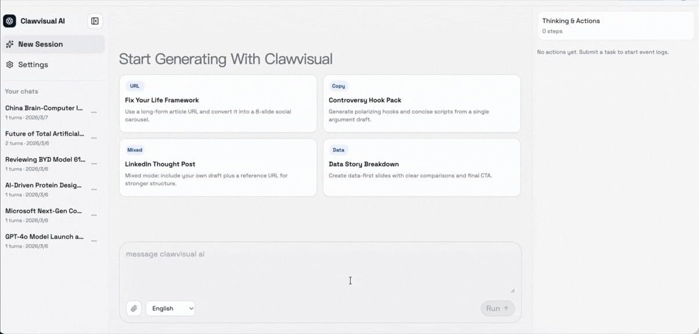

# clawvisual AI

clawvisual AI 是一个开源的 **URL to social carousel** 生成框架，面向创作者、增长团队和自动化场景中的 **agent workflow**。

你可以把长文章或 URL 转成可发布的社媒轮播内容：标题、caption、hashtags、slide 文案和生成图片。它同时支持 **MCP**，可被其他 agent 作为技能调用。

### 功能预览
<p>
  
</p>

## 功能亮点

- 直接吃 URL 或长文本，输出可发布的 carousel 结构
- 不是只做摘要，而是真的生成 slide 图片和视觉 prompt
- 有异步任务、进度事件、修订能力和下载输出
- 已支持竖版、方图、Story 和横版输出
- 提供 MCP 端点，可以作为其他 agent 的工具能力

## 文档

- [快速上手：URL 转社媒轮播图](docs/Quickstart-URL-to-Social-Carousel.zh-CN.md)
- [clawvisual 的 MCP 接入指南](docs/MCP-Integration-Guide-for-clawvisual.zh-CN.md)
- [Agent 工作流自动化使用场景](docs/Use-Cases-Agent-Workflow-Automation.zh-CN.md)

默认输出约束（fast 模式）：
- `post_title`：一句话标题钩子
- `post_caption`：精简正文，标准化为 100-300 字符
- `hashtags`：1-5 个标签
- `aspect_ratios`：可选 `4:5`、`1:1`、`9:16`、`16:9`
- `slides`：必须生成可用图片页（不是纯文案输出）
  - 每页需包含 `image_url` 与 `visual_prompt`
  - 封面页（`slide_id: 1`）优先保证第一眼识别度与钩子强度

## 真实示例

本地实测 URL：
- [How to fix your entire life in 1 day](https://letters.thedankoe.com/p/how-to-fix-your-entire-life-in-1)

生成输出（`output_language: zh-CN`，`max_slides: 8`）：

```json
{
  "post_title": "为什么你年年立Flag，年年都打脸？",
  "post_caption": "90%的新年计划都会失败，因为你只是在玩一场“给别人看”的地位游戏。真正的改变，从来不是靠意志力死撑，而是源于深层的自我重构。当你对现状的厌恶超过了对未知的恐惧，改变才会真正发生。",
  "hashtags": ["#自律", "#AI", "#Productivity", "#ContentStrategy", "#Marketing"]
}
```

生成 slide 预览：

<p>
  
  
</p>

## 本地启动（Web）

1. 安装依赖：

```bash
npm install
```

2. 创建本地环境变量文件：

```bash
cp .env.local.template .env.local
```

3. `.env.local` 至少填写这 1 项：
- `LLM_API_KEY`

`LLM_API_URL` 与 `LLM_MODEL` 已有默认值（OpenRouter + Gemini Flash）：
- `LLM_API_URL=https://openrouter.ai/api/v1/chat/completions`
- `LLM_MODEL=google/gemini-3-flash-preview`

本地开发的重要说明：
- `.env.local.template` 现在默认把 `CLAWVISUAL_API_KEYS` 留空
- 本地请求默认不需要 `x-api-key`，只有你显式配置了 `CLAWVISUAL_API_KEYS` 才需要带
- 如果你启用了 API Key 校验，请在 `x-api-key` 里传入同一个已配置值
- 如果你想测试真实图片生成，而不是占位渐变图/SVG，还需要设置可用的 `GEMINI_API_KEY` 和 `NANO_BANANA_MODEL`
- 如果当前 provider 不支持 `LLM_COPY_POLISH_MODEL`，文案 polish 阶段可能会被跳过

4. 启动开发服务器：

```bash
npm run dev
```

5. 浏览器访问：
- `http://localhost:3000`

如果 `3000` 已被占用，Next.js 会自动切到别的端口，比如 `3001`。请以终端里实际显示的端口为准。

## CLI（npm -g）

全局安装 CLI：

```bash
npm install -g clawvisual
```

安装后可直接执行：

```bash
clawvisual set CLAWVISUAL_LLM_API_KEY "your_openrouter_key"
# 可选
clawvisual set CLAWVISUAL_LLM_MODEL "google/gemini-3-flash-preview"
clawvisual initialize
clawvisual status
clawvisual tools
clawvisual convert --input "在这里粘贴长文本或 URL" --slides auto
clawvisual status --job <job_id>
```

`clawvisual initialize` 在 `CLAWVISUAL_MCP_URL` 指向 localhost 时会自动拉起本地服务，并输出可访问的 Web URL；之后可继续执行 `clawvisual xxx` 命令。
`clawvisual status` 会校验服务指纹（必须是 `clawvisual-mcp`），避免同端口其他 MCP 服务造成误判。
`clawvisual set/get/unset/config` 会把 CLI 配置写入 `~/.clawvisual/config.json`（key 大小写不敏感，例如 `clawvisual set clawvisual_llm_api_key ...`）。

CLI 相关环境变量：
- `CLAWVISUAL_MCP_URL`（默认：`http://localhost:3000/api/mcp`）
- `CLAWVISUAL_API_KEY`（仅在开启 API Key 校验时需要）
- `CLAWVISUAL_LLM_API_KEY` / `CLAWVISUAL_LLM_API_URL` / `CLAWVISUAL_LLM_MODEL`（CLI 层别名，会映射为服务端 `LLM_*` 环境变量）

## Docker

构建镜像：

```bash
docker build -t clawvisual:1.0.0 .
```

运行容器：

```bash
docker run --rm -p 3000:3000 \
  -e LLM_API_KEY=your_openrouter_api_key \
  -e GEMINI_API_KEY=your_gemini_api_key \
  -e NANO_BANANA_MODEL=gemini-3.1-flash-image-preview \
  clawvisual:1.0.0
```

GHCR 发布后的运行示例：

```bash
docker run --rm -p 3000:3000 \
  -e LLM_API_KEY=your_openrouter_api_key \
  ghcr.io/<owner>/clawvisual:<tag>
```

## 工作流

1. 输入 URL 或长文本
2. 运行技能流水线生成 hooks、slide 文案、视觉图和 hashtags
3. 轮询异步任务状态直到完成
4. 按需发起修订（`rewrite_copy_style` / `regenerate_cover` / `regenerate_slides`）
5. 导出下载最终素材

Web 输入框下方现在提供 `Aspect ratio` 选择器，可以直接切换竖版、方图、Story 和横版（`16:9`）输出。

## 最小冒烟测试

执行 `npm run dev` 之后，建议先确认服务健康，再测试完整 UI 流程。

1. 打开 OpenAPI：

```bash
curl http://localhost:3000/api/openapi.json
```

2. 列出 MCP tools：

```bash
curl -X POST http://localhost:3000/api/mcp \
  -H 'content-type: application/json' \
  --data '{"jsonrpc":"2.0","id":1,"method":"tools/list"}'
```

3. 创建一个转换任务：

```bash
curl -X POST http://localhost:3000/api/v1/convert \
  -H 'content-type: application/json' \
  --data '{
    "input_text": "Open source projects grow faster when onboarding is simple and the value is visible on first use.",
    "max_slides": 4,
    "aspect_ratios": ["16:9"]
  }'
```

4. 持续轮询返回的 `status_url`，直到 `status` 变成 `completed` 或 `failed`

首次运行时的预期行为：
- 接口会先快速返回 `202`，任务异步执行
- 在 `fast` 模式下，一些质量环节显示 `skipped:fast_mode` 是正常行为
- 如果外部模型或图片能力没有完整配置，部分质量或图片步骤可能退化或走回退路径
- 如果 `NANO_BANANA_MODEL` 仍然保留模板占位值，图片生成可能会反复重试，最后回退到占位输出

## OpenClaw 接入（作为 Skill）

clawvisual 可以通过 MCP 方式，作为 OpenClaw 的本地/工作区 Skill 接入。

1. 启动 clawvisual 服务：

```bash
npm install
cp .env.local.template .env.local
npm run dev
```

2. 将本仓库 Skill 安装到 OpenClaw：
- 把 [skills/clawvisual-mcp](skills/clawvisual-mcp) 复制到以下任一位置：
  - `<openclaw-workspace>/skills/clawvisual-mcp`（工作区级）
  - `~/.openclaw/skills/clawvisual-mcp`（本机共享）

3. 配置 Skill 运行环境变量：

```bash
CLAWVISUAL_MCP_URL=http://localhost:3000/api/mcp
CLAWVISUAL_API_KEY=<如果开启鉴权则填写>
```

如果开发服务器实际跑在 `3001` 或其他端口，这里的 `CLAWVISUAL_MCP_URL` 也要同步修改。

如果你显式配置了 `CLAWVISUAL_API_KEYS`，这里的 `CLAWVISUAL_API_KEY` 也应该设置为其中一个可接受的值。

4. 本地测试 Skill 客户端：

```bash
npm run skill:clawvisual -- tools
```

## MCP

- 端点：`POST /api/mcp`
- 方法：`initialize`、`tools/list`、`tools/call`
- 工具：`convert`、`job_status`、`revise`、`regenerate_cover`

## FAQ

### 可以自托管吗？

可以。项目支持本地/服务器部署，按 `.env.local` 配置即可运行。

### 支持批量处理吗？

支持。可通过 API 或 MCP 在脚本/工作流中并发提交多个异步任务。

### 能用于自动化流程吗？

可以。MCP 接口就是为自动化和 agent orchestration 设计的。

### 能被其他 agent 作为 skill 调用吗？

可以，直接复用 `skills/clawvisual-mcp` 并配置 `CLAWVISUAL_MCP_URL`。

## 路线图

- 更完善的批处理调度与队列控制
- 更多模板与风格预设
- 更强的评测集与回归保障
- 更细粒度的素材导出格式
- 持续发布版本与更新说明

## 已实现架构（V1 脚手架）

- 框架：Next.js App Router + TypeScript
- API：
  - `POST /api/v1/convert`：启动 16 个技能链路并返回 `job_id`
  - `GET /api/v1/jobs/:id`：查询状态/进度/结果
  - `POST /api/mcp`：MCP JSON-RPC 端点（`initialize`、`tools/list`、`tools/call`）
  - `GET /api/openapi.json`：导出 OpenAPI Schema
- 技能系统：`src/lib/skills` 中包含 16 个原子异步技能
- Prompt 模板：`src/lib/prompts/index.ts`
- 编排器：`src/lib/orchestrator.ts`
- 队列：
  - 本地内存队列（便于本地开发）
- API Key 校验：`src/lib/auth/api-key.ts`

## 目录结构

- `src/app/page.tsx`：clawvisual 控制台 UI
- `src/app/api/v1/convert/route.ts`：转换入口
- `src/app/api/v1/jobs/[id]/route.ts`：任务状态查询
- `src/app/api/openapi.json/route.ts`：OpenAPI 导出
- `src/lib/types`：统一类型与上下文对象
- `src/lib/skills`：16 个原子技能模块

## 环境变量

当前脚手架会读取以下变量：

- `LLM_API_URL`（可选，默认 `https://openrouter.ai/api/v1/chat/completions`）
- `LLM_API_KEY`
- `LLM_MODEL`（可选，默认 `google/gemini-3-flash-preview`）
- `LLM_TIMEOUT_MS`（可选，默认 `25000`）
- `LLM_COPY_FALLBACK_MODEL`（可选，默认 `google/gemini-2.5-flash`）
- `LLM_COPY_POLISH_MODEL`（可选，默认 `openai/gpt-5.1-mini`）
- `GEMINI_API_KEY`
- `NANO_BANANA_MODEL`
- `NANO_BANANA_TIMEOUT_MS`（可选，默认 `60000`）
- `NANO_BANANA_TRANSIENT_RETRY_MAX`（可选，默认 `2`）
- `NANO_BANANA_RETRY_BASE_DELAY_MS`（可选，默认 `450`）
- `QUALITY_LOOP_ENABLED`（可选，默认 `true`）
- `QUALITY_AUDIT_THRESHOLD`（可选，默认 `78`）
- `QUALITY_IMAGE_COVER_THRESHOLD`（可选，默认 `85`）
- `QUALITY_IMAGE_INNER_THRESHOLD`（可选，默认 `78`）
- `QUALITY_COVER_FIRST_GLANCE_THRESHOLD`（可选，默认 `82`）
- `QUALITY_COVER_NOVELTY_THRESHOLD`（可选，默认 `80`）
- `QUALITY_COVER_CANDIDATE_COUNT`（可选，默认 `1`）
- `QUALITY_MAX_COPY_ROUNDS`（可选，默认 `1`）
- `QUALITY_MAX_IMAGE_ROUNDS`（可选，默认 `0`）
- `QUALITY_MAX_EXTRA_IMAGES`（可选，默认 `1`）
- `QUALITY_IMAGE_LOOP_MAX_MS`（可选，默认 `120000`）
- `QUALITY_IMAGE_AUDIT_SCOPE`（可选，`cover` 或 `all`，默认 `cover`）
- `PIPELINE_MODE`（可选，`fast` 或 `full`，默认 `fast`）
- `PIPELINE_MAX_DURATION_MS`（可选，默认 `300000`）
- `PIPELINE_ENABLE_SOURCE_INTEL`（可选，fast 模式默认 `false`）
- `PIPELINE_ENABLE_STORYBOARD_QUALITY`（可选，fast 模式默认 `false`）
- `PIPELINE_ENABLE_STYLE_RECOMMENDER`（可选，fast 模式默认 `false`）
- `PIPELINE_ENABLE_ATTENTION_FIXER`（可选，fast 模式默认 `false`）
- `PIPELINE_ENABLE_POST_COPY_QUALITY`（可选，fast 模式默认 `false`）
- `PIPELINE_ENABLE_FINAL_AUDIT`（可选，fast 模式默认 `false`）
- `OPENROUTER_API_KEY`
- `TAVILY_API_KEY`
- `SERPER_API_KEY`
- `JINA_API_KEY`

运行时可观测性：
- Thinking & Actions 事件时间线包含每步 token 增量（`in/out/total`，前提是上游 provider 返回 usage）
- 最终 `skill_logs` 包含 `llm_usage_summary`，用于请求级 token 汇总

API 安全控制：
- `CLAWVISUAL_API_KEYS`：逗号分隔可用 key 列表
- `CLAWVISUAL_ALLOW_NO_KEY`：本地开发默认 `true`

## 说明

- 项目已包含异步转换流水线 + 修订引擎 + MCP 兼容 JSON-RPC 端点
- 真实生产集成（Flux/Midjourney、Redis/BullMQ Worker、PostgreSQL、satori 渲染）仍是可插拔扩展点

## MCP 工具

`POST /api/mcp` 支持：

- `convert`：创建转换任务
- `job_status`：查询当前任务状态/结果
- `revise`：对文案或图片发起修订任务
- `regenerate_cover`：基于任务修订或直接 prompt 重新生成封面

## Skill 模板

可复用的外部技能包：

- [skills/clawvisual-mcp/SKILL.md](skills/clawvisual-mcp/SKILL.md)
- [skills/clawvisual-mcp/scripts/clawvisual-mcp-client.mjs](skills/clawvisual-mcp/scripts/clawvisual-mcp-client.mjs)

快捷命令：

- `npm run skill:clawvisual -- tools`

## 常见本地问题

- `Missing x-api-key`
  - 原因：你显式启用了 `CLAWVISUAL_API_KEYS`
  - 处理：带上 `x-api-key`，或者清空 `CLAWVISUAL_API_KEYS`

- MCP 客户端连错服务
  - 原因：`npm run dev` 自动切到了 `3001`，但客户端默认还在请求 `http://localhost:3000/api/mcp`
  - 处理：把 `CLAWVISUAL_MCP_URL` 改成真实端口

- `dev` 或 `build` 出现 Next.js workspace root 警告
  - 原因：仓库上层还存在其他 lockfile，Next.js 推断了更高一级的 workspace root
  - 处理：在 `next.config.ts` 里设置 `turbopack.root`，或者移除无关的上层 lockfile
