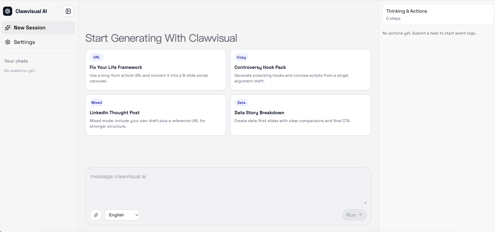
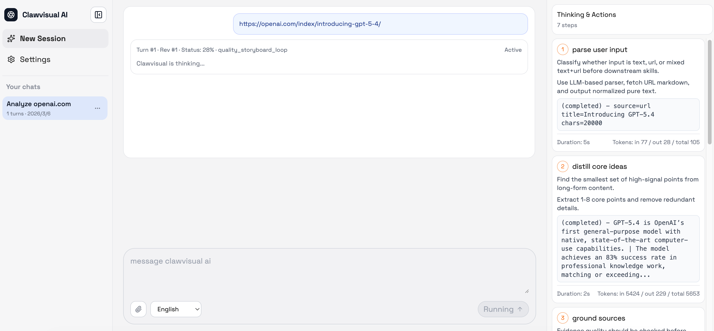
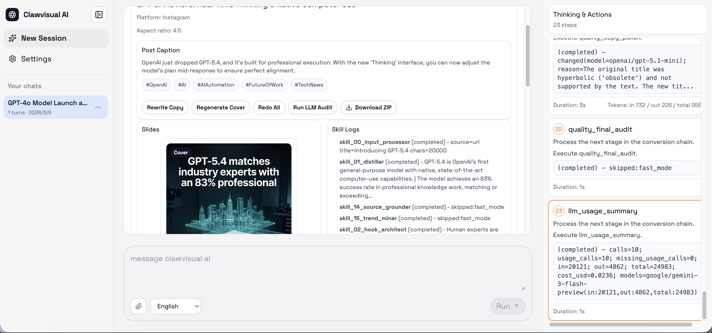
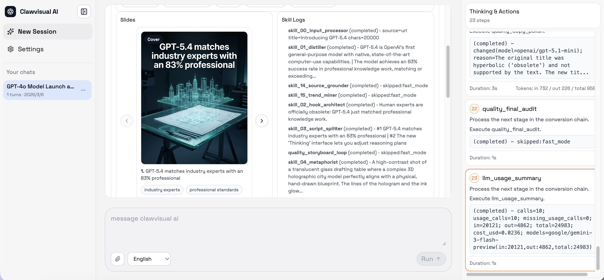

# clawvisual AI

clawvisual AI 是一个 Agent + Skills 的流水线项目，用于将长文本转换为适合社媒传播的短内容轮播图/信息图。

默认输出约束（fast 模式）：
- `post_title`：一句话标题钩子
- `post_caption`：精简正文，标准化为 100-300 字符
- `hashtags`：1-5 个标签
- `slides`：必须生成可用图片页（不是纯文案输出）
  - 每页需包含 `image_url` 与 `visual_prompt`
  - 封面页（`slide_id: 1`）优先保证第一眼识别度与钩子强度

## 截图

<p>
  
  
  
  
</p>

## 本地启动（Web）

1. 安装依赖：

```bash
npm install
```

2. 创建本地环境变量文件：

```bash
cp .env.local.template .env.local
```

3. 至少补齐 `.env.local` 中这 3 项：
- `LLM_API_URL`
- `LLM_API_KEY`
- `LLM_MODEL`

4. 启动开发服务器：

```bash
npm run dev
```

5. 浏览器访问：
- `http://localhost:3000`

## 已实现架构（V1 脚手架）

- 框架：Next.js App Router + TypeScript
- API：
  - `POST /api/v1/convert`：启动 16 个技能链路并返回 `job_id`
  - `GET /api/v1/jobs/:id`：查询状态/进度/结果
  - `POST /api/mcp`：MCP JSON-RPC 端点（`initialize`、`tools/list`、`tools/call`）
  - `GET /api/openapi.json`：导出 OpenAPI Schema
- 技能系统：`src/lib/skills` 中包含 16 个原子异步技能
- Prompt 模板：`src/lib/prompts/index.ts`
- 编排器：`src/lib/orchestrator.ts`
- 队列：
  - 本地内存队列（便于本地开发）
- API Key 校验：`src/lib/auth/api-key.ts`

## 目录结构

- `src/app/page.tsx`：clawvisual 控制台 UI
- `src/app/api/v1/convert/route.ts`：转换入口
- `src/app/api/v1/jobs/[id]/route.ts`：任务状态查询
- `src/app/api/openapi.json/route.ts`：OpenAPI 导出
- `src/lib/types`：统一类型与上下文对象
- `src/lib/skills`：16 个原子技能模块

## 环境变量

当前脚手架会读取以下变量：

- `LLM_API_URL`
- `LLM_API_KEY`
- `LLM_MODEL`
- `LLM_TIMEOUT_MS`（可选，默认 `25000`）
- `LLM_COPY_FALLBACK_MODEL`（可选，默认 `google/gemini-2.5-flash`）
- `LLM_COPY_POLISH_MODEL`（可选，默认 `openai/gpt-5.1-mini`）
- `GEMINI_API_KEY`
- `NANO_BANANA_MODEL`
- `NANO_BANANA_TIMEOUT_MS`（可选，默认 `60000`）
- `NANO_BANANA_TRANSIENT_RETRY_MAX`（可选，默认 `2`）
- `NANO_BANANA_RETRY_BASE_DELAY_MS`（可选，默认 `450`）
- `QUALITY_LOOP_ENABLED`（可选，默认 `true`）
- `QUALITY_AUDIT_THRESHOLD`（可选，默认 `78`）
- `QUALITY_IMAGE_COVER_THRESHOLD`（可选，默认 `85`）
- `QUALITY_IMAGE_INNER_THRESHOLD`（可选，默认 `78`）
- `QUALITY_COVER_FIRST_GLANCE_THRESHOLD`（可选，默认 `82`）
- `QUALITY_COVER_NOVELTY_THRESHOLD`（可选，默认 `80`）
- `QUALITY_COVER_CANDIDATE_COUNT`（可选，默认 `1`）
- `QUALITY_MAX_COPY_ROUNDS`（可选，默认 `1`）
- `QUALITY_MAX_IMAGE_ROUNDS`（可选，默认 `0`）
- `QUALITY_MAX_EXTRA_IMAGES`（可选，默认 `1`）
- `QUALITY_IMAGE_LOOP_MAX_MS`（可选，默认 `120000`）
- `QUALITY_IMAGE_AUDIT_SCOPE`（可选，`cover` 或 `all`，默认 `cover`）
- `PIPELINE_MODE`（可选，`fast` 或 `full`，默认 `fast`）
- `PIPELINE_MAX_DURATION_MS`（可选，默认 `300000`）
- `PIPELINE_ENABLE_SOURCE_INTEL`（可选，fast 模式默认 `false`）
- `PIPELINE_ENABLE_STORYBOARD_QUALITY`（可选，fast 模式默认 `false`）
- `PIPELINE_ENABLE_STYLE_RECOMMENDER`（可选，fast 模式默认 `false`）
- `PIPELINE_ENABLE_ATTENTION_FIXER`（可选，fast 模式默认 `false`）
- `PIPELINE_ENABLE_POST_COPY_QUALITY`（可选，fast 模式默认 `false`）
- `PIPELINE_ENABLE_FINAL_AUDIT`（可选，fast 模式默认 `false`）
- `OPENROUTER_API_KEY`
- `TAVILY_API_KEY`
- `SERPER_API_KEY`
- `JINA_API_KEY`

运行时可观测性：
- Thinking & Actions 事件时间线包含每步 token 增量（`in/out/total`，前提是上游 provider 返回 usage）
- 最终 `skill_logs` 包含 `llm_usage_summary`，用于请求级 token 汇总

API 安全控制：
- `CLAWVISUAL_API_KEYS`：逗号分隔可用 key 列表
- `CLAWVISUAL_ALLOW_NO_KEY`：本地开发默认 `true`

## 说明

- 项目已包含异步转换流水线 + 修订引擎 + MCP 兼容 JSON-RPC 端点
- 真实生产集成（Flux/Midjourney、Redis/BullMQ Worker、PostgreSQL、satori 渲染）仍是可插拔扩展点

## MCP 工具

`POST /api/mcp` 支持：

- `convert`：创建转换任务
- `job_status`：查询当前任务状态/结果
- `revise`：对文案或图片发起修订任务
- `regenerate_cover`：基于任务修订或直接 prompt 重新生成封面

## Skill 模板

可复用的外部技能包：

- [skills/clawvisual-mcp/SKILL.md](skills/clawvisual-mcp/SKILL.md)
- [skills/clawvisual-mcp/scripts/clawvisual-mcp-client.mjs](skills/clawvisual-mcp/scripts/clawvisual-mcp-client.mjs)

快捷命令：

- `npm run skill:clawvisual -- tools`
